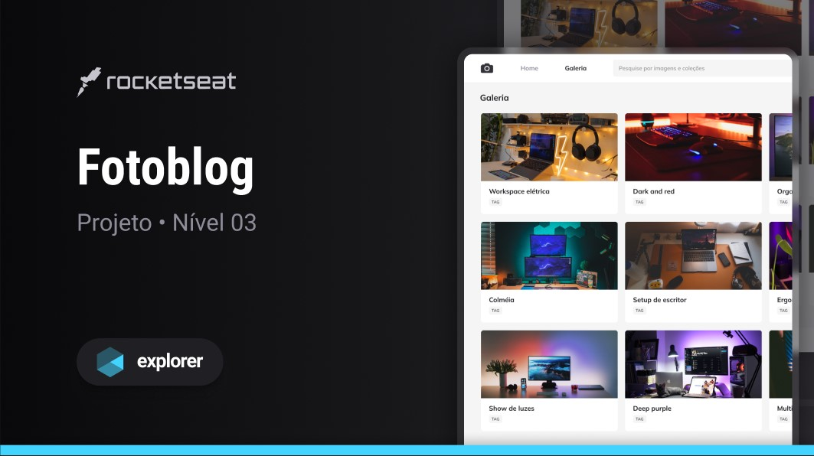
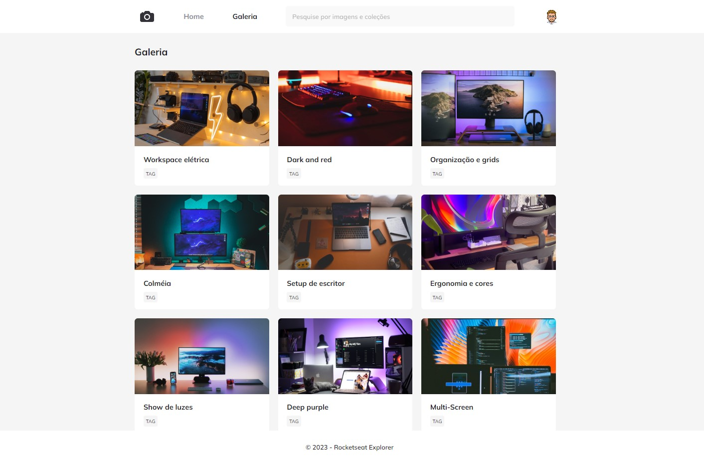

<h1 align="center"> Projeto Fotoblog  </h1>

Programa exclusivo e gratuito, promovido pela Rocketseat para ensino de tecnologias WEB.

  <a href="#-tecnologias">Tecnologias</a>&nbsp;&nbsp;&nbsp;|&nbsp;&nbsp;&nbsp;
  <a href="#-projeto">Projeto</a>&nbsp;&nbsp;&nbsp;|&nbsp;&nbsp;&nbsp;
  <a href="#-layout">Layout</a>&nbsp;&nbsp;&nbsp;|&nbsp;&nbsp;&nbsp;
  <a href="#memo-licença">Licença</a>

  

  

 

## 🚀 Tecnologias

Esse projeto foi desenvolvido com as seguintes tecnologias:

- HTML e CSS
- Git e Github
- Figma

## 💻 Projeto

O Fotoblog é um projeto de galeria de fotos, que é desenvolvido no nível 03 do Explorer, o programa completo da Rocketseat.

Você pode visualizar o projeto através [DESSE LINK](https://gbenini.github.io/fotoblog-project/) 👀

## 🔖 Layout

Você pode visualizar o layout do projeto através [DESSE LINK](https://www.figma.com/file/STY3o0mzGINk4iyO9Ke07s/Fotoblog-%E2%80%A2-Projeto-Explorer-(Community)?type=design&node-id=201-95&mode=design&t=Jx1qLQAZ3nz3vgiY-0). É necessário ter conta no [Figma](https://figma.com) para acessá-lo.

## :memo: Licença

Esse projeto está sob a licença MIT.

---

Feito com ♥ by GBenini e Rocketseat :wave: [Participe da nossa comunidade!](https://discord.gg/rocketseat)